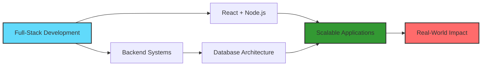

# Aman Pratap Singh

<div align="center">

```ascii
╔══════════════════════════════════════════════════════════════╗
║  Computer Science Undergraduate | Full-Stack Developer      ║
║              Technical Secretary, CTA                        ║
╚══════════════════════════════════════════════════════════════╝
```

[](https://github.com/aman67032)
[](https://www.linkedin.com/in/aman-pratap-singh-bb7b3532a)
[](https://amanpratapsingh.dev)
[](mailto:amanpratapsingh@jklu.edu.in)

</div>

---

## About Me

```typescript
const aman = {
    education: "B.Tech Computer Science @ JK Lakshmipat University, Jaipur",
    role: "Technical Secretary, Council of Technical Affairs",
    passion: ["Full-Stack Development", "Hackathons", "Problem Solving"],
    experience: "Building institutional, hackathon & personal projects",
    focus: "Scalable real-world applications",
    stats: {
        hackathons: "10+",
        projects: "15+",
        teachingHours: "100+",
        contributions: "Active on GitHub"
    }
};
```

I am a Computer Science student specializing in **full-stack web development**, with hands-on experience in building production-grade applications. I thrive in hackathons, lead technical initiatives at my university, and continuously work on projects that bridge technology with real-world impact.

### Quick Facts

<div align="center">

| Category | Details |
|----------|---------|
| **Current Position** | Technical Secretary, Council of Technical Affairs |
| **University** | JK Lakshmipat University, Jaipur |
| **Experience** | 1+ years in Full-Stack Development |
| **Hackathons** | Participated in 10+ competitions, Top 6 at Circuit Jam |
| **Teaching** | Python Lab Teaching Assistant (100+ hours) |
| **Projects** | 15+ completed (Institutional, Hackathon & Personal) |
| **Open Source** | Active contributor on GitHub |
| **Specialization** | Full-Stack Web Development, Backend Systems |

</div>

---

## Tech Stack

<div align="center">

| Category | Technologies |
|----------|-------------|
| **Languages** |      |
| **Frontend** |    |
| **Backend & Database** |    |
| **AI/ML** |  SBERT (NLP) |
| **Tools & Design** |     |
| **Hardware** |  STM32 |

</div>

---

## Featured Projects

<table>
<tr>
<td width="50%">

### HerbspHere
Interactive web platform showcasing medicinal herbs and their applications with engaging UI design.

**Tech Stack:** HTML, CSS, JavaScript

[](https://github.com/aman67032/HerbspHere)

</td>
<td width="50%">

### Health Connect
Healthcare web application designed for elderly assistance with medicine reminders and health management features.

**Tech Stack:** TypeScript, Web Technologies

[](https://github.com/aman67032/Health_Connect)

</td>
</tr>

<tr>
<td width="50%">

### Exam Quiz Portal – JKLU
Institutional-level examination and quiz management system built for university-wide deployment.

**Tech Stack:** TypeScript

[](https://github.com/aman67032/Exam_quiz_Portal_Lib_JKLU)

</td>
<td width="50%">

### Exam Portal Backend – JKLU
Robust backend system handling exam logic, workflows, and data management.

**Tech Stack:** Python

[](https://github.com/aman67032/Exam_portal_backend_JKLU_solomaze)

</td>
</tr>

<tr>
<td width="50%">

### CareSure (EBM) – Full Stack
Enterprise-grade application with comprehensive frontend and backend systems for business workflow management.

**Tech Stack:** TypeScript, JavaScript

[](https://github.com/aman67032/CareSure_Frontend_EBM)
[](https://github.com/aman67032/Careure_EBM_Backend)

</td>
<td width="50%">

### RTI Portal
Civic technology platform providing Right to Information resources and tools for students and citizens.

**Tech Stack:** HTML, CSS, JavaScript

[](https://github.com/aman67032/RTI_MAIN)

</td>
</tr>

<tr>
<td width="50%">

### Game Garden – Adventure
Browser-based adventure game featuring interactive gameplay mechanics, developed during hackathon sprint.

**Tech Stack:** JavaScript

[](https://github.com/aman67032/Game-Garden-Adventure-)

</td>
<td width="50%">

</td>
</tr>

</table>

---

## Experience Highlights

<div align="center">

```
┌─────────────────────────────────────────────────────────────┐
│ Technical Secretary                                         │
│ Council of Technical Affairs, JKLU                          │
│ • Leading technical initiatives & coordinating events       │
│ • Managing 50+ technical team members                       │
│ • Organizing hackathons, workshops, and tech talks          │
└─────────────────────────────────────────────────────────────┘

┌─────────────────────────────────────────────────────────────┐
│ Hackathon Enthusiast - 10+ Competitions                    │
│ • Circuit Jam (IIIT Surat) – TOP 6 Finish                  │
│ • Multiple internal and external hackathons                 │
│ • Problem-solving under time constraints                    │
│ • Team collaboration and rapid prototyping                  │
└─────────────────────────────────────────────────────────────┘

┌─────────────────────────────────────────────────────────────┐
│ Teaching Assistant - Python Programming Lab                │
│ • Mentoring 100+ students in programming fundamentals       │
│ • Conducting 50+ lab sessions                               │
│ • Debugging and code review assistance                      │
│ • Creating supplementary learning materials                 │
└─────────────────────────────────────────────────────────────┘

┌─────────────────────────────────────────────────────────────┐
│ Technical Coordinator - Sabrang, Aarambh                    │
│ • Managing technical events for 500+ participants           │
│ • Coordinating with 20+ speakers and judges                 │
│ • Handling logistics and technical infrastructure           │
│ • Ensuring smooth execution of college festivals            │
└─────────────────────────────────────────────────────────────┘
```

</div>

### Key Achievements

<div align="center">

| Achievement | Description |
|-------------|-------------|
| **Top 6 Finalist** | Circuit Jam Hackathon, IIIT Surat |
| **15+ Projects** | Successfully delivered institutional and personal projects |
| **100+ Students** | Mentored in Python programming |
| **10+ Hackathons** | Participated with consistent problem-solving performance |
| **50+ Events** | Coordinated as Technical Secretary |
| **2+ Years** | Active full-stack development experience |

</div>

---

## Current Focus

<div align="center">



</div>

- Developing scalable full-stack applications using modern frameworks
- Designing robust backend systems with PostgreSQL and Node.js
- Competitive problem-solving through hackathons
- Building production-ready solutions for real-world challenges

---

## GitHub Statistics & Activity

<div align="center">

### Contribution Overview


### Most Used Languages


### Contribution Streak


### Activity Graph

[](https://github.com/aman67032)

</div>

---

## Contribution Metrics

<div align="center">

| Metric | Details |
|--------|---------|
| **Total Repositories** |  |
| **Total Stars Earned** |  |
| **Total Forks** |  |
| **Pull Requests** |  |
| **Issues Opened** |  |
| **Contributions (2024)** |  |

</div>

---

## Recent Activity

<div align="center">

<!--START_SECTION:activity-->
<!-- This section can be automated with GitHub Actions -->
<!-- For now, manually update your recent activities -->

```
Recent Contributions:
├── 🔨 Pushed to CareSure_Frontend_EBM
├── 🔀 Merged PR in Exam_portal_backend_JKLU_solomaze
├── ⭐ Created new repository: [Recent Project Name]
├── 📝 Updated documentation in Health_Connect
└── 🐛 Fixed bugs in Game-Garden-Adventure
```

</div>

---

## Let's Connect

<div align="center">

```
┌──────────────────────────────────────────────────────────────┐
│                                                              │
│  "Learning by building. Improving by doing."                │
│                                                              │
│  Open to collaborations, opportunities, and conversations   │
│                                                              │
└──────────────────────────────────────────────────────────────┘
```

**Feel free to reach out for collaborations or just a tech chat!**

[](https://github.com/aman67032)
[](https://www.linkedin.com/in/aman-pratap-singh-bb7b3532a)
[](mailto:amanpratapsingh@jklu.edu.in)

</div>

---

<div align="center">

⭐ **If you find my work interesting, consider giving it a star!** ⭐

</div>
